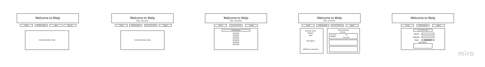
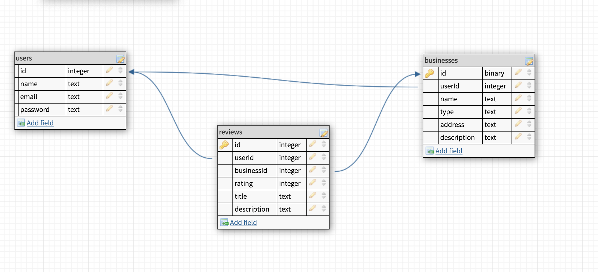

# GA-Group-Project-2

## Deployed Version 

https://welpfrontend.herokuapp.com/

## Overview

---

## Site sections
Your site should have links that are always visible that let the user navigate between these sections. In the User stories, there is more info on which links are visible in which circumstances.
1. Home: just contains some static text with a welcome message, a summary of the purpose of the site, and basic instructions on how to use the site.
2. Signup: contains a form for the user to sign up with email, password, and name.
3. Login: contains a form for the user to login with email and password.
4. List Your Business: contains a form to list a business (described in User stories).
5. All Businesses: list of all businesses
6. Single Business view: note that there is no nav link to this section; rather, you get there by clicking on the name of a business in the All Businesses section

## User Stories

---

1. The page has a set of always-visible links (described in Site Sections).
2. When I load the page, I am on the home section. The page is on the logged-out state: only Home, All Businesses, Signup, and Login links are visible.
3. I can create an account. Emails must be unique. If I use a duplicate email, I see a message indicating this. After successful account creation, I am back on the home section, and the page is in the logged-in state.
4. In the logged-in state, only Home, All Businesses, List Your Business, and Logout links are visible.
5. If I close and re-open the page, it remembers my logged-in / logged-out state.
6. The logout link logs me out and displays the home section.
7. The login link reveals a login form. When submitted, if login is successful, I'm taken to the logged-in state of the home page. If unsuccessful, I'm shown a message indicating so.
8. The All Businesses link takes me to the All Businesses section described below. Same for List Your Business.
9. When I click on the List Your Business link, I see a form that lets me create a new business, with fields for name, address, description, and type. The type is a dropdown that lets me pick from one of a number of pre-defined business types (restaurant, clothing, etc). After submitting this form, I'm taken to the All Businesses section, which now contains my new business.
10. Clicking on the name of a business in the All Businesses section takes me to the Single Business view for that business. Here I can see the name, address, type, and description of this business. I can also see the name of the user who listed it.
11. In Single Business view, if I am logged in as the business's creator, there are buttons to edit and delete the business.
12. Beneath this (still in Single Business view), I can see a list of all reviews that have been left on this business, along with the name of the user who left the review. Each review has headline, a content, and an integer rating out of 5. Reviews are ordered with the most recent review at the top, and the oldest review at the bottom.
13. Still in Single Business view, IF I am logged in, there is a form to leave a review (also consisting of headline, content, and rating out of 5). (If I am not logged in, this form is not present.) This form is sandwiched between the business info and the list of reviews, so that I don't have to scroll all the way to the bottom of a potentially long list of reviews to get to it. When the form is submitted, the new review appears at the top of the list.

## Routes Inventory

| Route       | Description |
| ----------- | ----------- |
| POST/users | add a new user to users table |
| POST/users/login  | send info to back to check password and send user info to the front |
| GET/users/:id/businesses | get all businesses owned by user |
| GET/users/:id/reviews | get all reviews that a user has written |
| POST/businesses | add a new business |
| GET/businesses | get all businesses |
| GET/businesses/:id | get info on specific business |
| GET/businesses/:id/reviews| get all reviews on a business |
| DELETE/businesses/:id/delete| delete a business |
| PUT/businesses/:id/update| update a business |
| POST/reviews| add a new review |
| DELETE/reviews/:id/delete| delete a review |
| PUT/reviews/:id/update| edit a review |

## MVP Checklist 

---

## Stretch Goals

---

